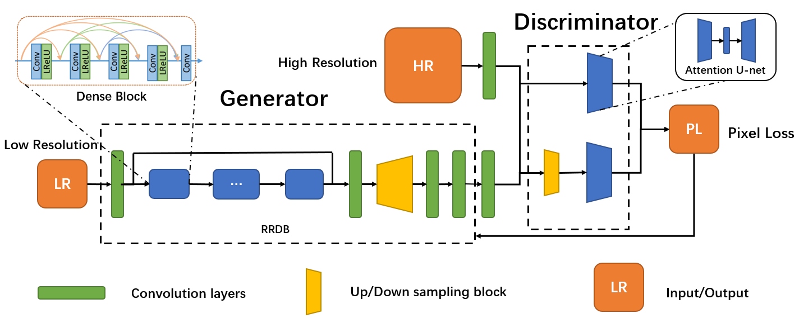
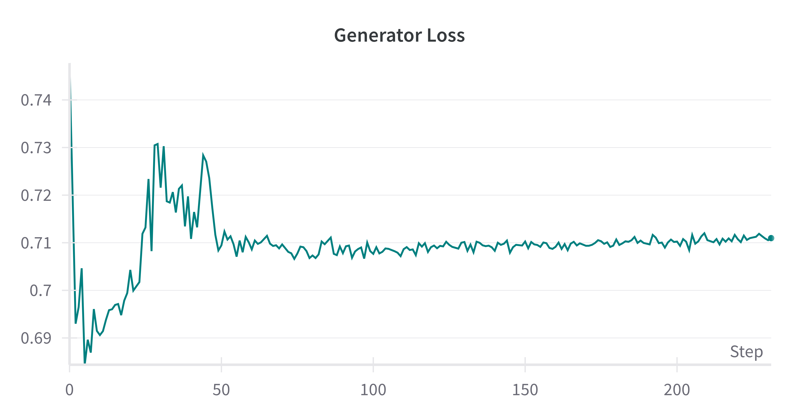
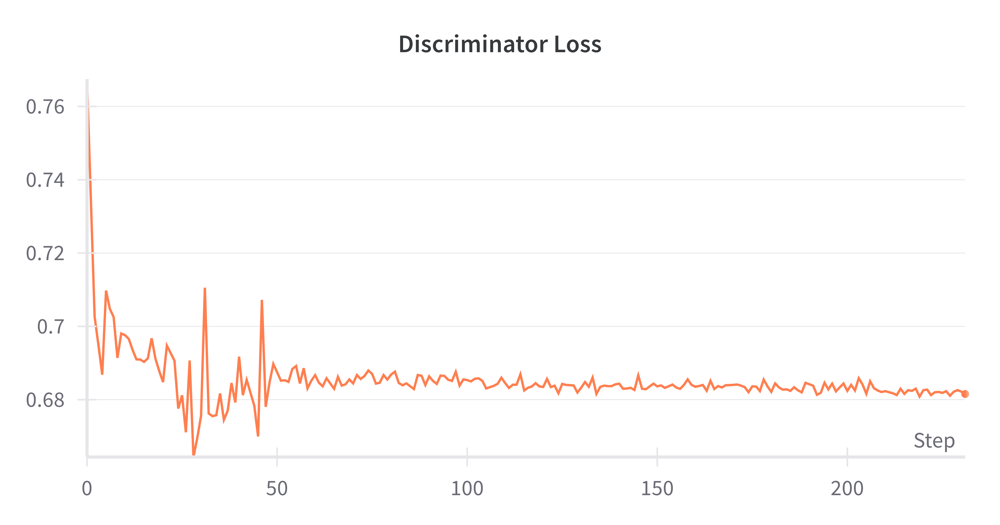
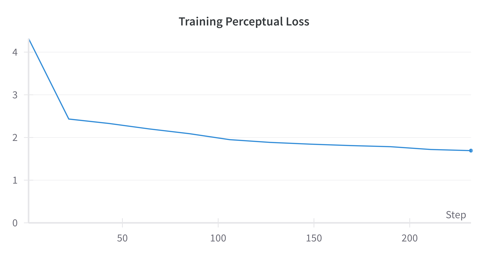
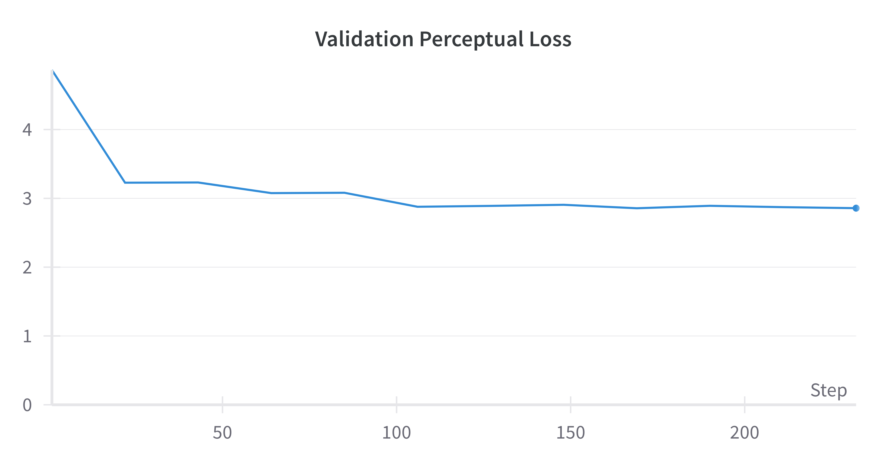

# Image Enhancement Model API

This repository contains a state-of-the-art image enhancement model API built on the Enhanced Super-Resolution Generative Adversarial Networks (ESRGAN) architecture. Our model is trained on the high-quality DIV2K dataset, designed to provide significant improvements in photo resolution and quality. The API takes in an image and upscales it by 4x resolution.

## Features

- **High-Resolution Output:** Enhance images up to 4x their original resolution without losing detail.
- **Pre-Trained Model:** Utilizes the powerful DIV2K dataset for training, which includes a diverse set of high-resolution images.
- **Easy Integration:** Simple API for easy integration with existing projects or applications.
- **Real-Time Enhancement:** Capable of enhancing images in real-time with minimal latency.

## Getting Started

### Prerequisites

- Python 3.8+
- Flask
- TensorFlow 2.x
- CUDA (for GPU support)

### Installation

Clone the repository and install the required packages:

```bash
git clone https://github.com/your-username/image-enhancement-model-api.git
cd image-enhancement-model-api
pip install -r requirements.txt
```

## API Usage

### Enhance an Image

To enhance an image, make a POST request to the `/enhance` endpoint with the image data:

```bash
curl -X POST -F "image=@path_to_your_image.jpg" http://localhost:5000/enhance
```

The API will return the enhanced image in the response.

## Model Details

The model is based on the ESRGAN architecture, which is a robust approach to enhancing image resolution through generative adversarial networks. The key features of this model include:

- **Residual-in-Residual Dense Blocks (RRDB):** These blocks help in reconstructing more details from low-resolution images.
- **GAN-based Architecture:** Utilizes a discriminator network to guide the super-resolution process, resulting in more realistic images.

### Model Architecture



## Dataset

This model has been trained on the DIV2K dataset, which is a benchmark for image super-resolution techniques. It contains 800 high-quality images, which are diverse in scenes and subjects, providing a robust training set for high-resolution image enhancement.

## Training Results

Here are the hyperparameters I used in training the model:

- *Residual-in-Residual Dense Blocks:* 23
- *Batch Size: 10*
- *Crop Size: 356*
- *Lambda Weight: 0.3*
- *Learning Rate: 0.0001
- *Epochs: 240*

The Dataset was split into validation and training, and after every 20 epochs the validation and training loss over the epoch were logged. The graphs below show the discriminator and GAN losses over the training. The validation loss and training loss show the perceptual loss at each validation step over the training and vlidation data.

The Generator loss is maximizing the probability that the Discriminator predicts an image generated as fake. The Discriminator is conversely trying to learn the real images different from the fake images using the target high resolution image versus the generated image as the fake one.
Here are the graphs over the training period for the Discriminator and the Generator Losses:

<p>
  
  
</p>

The Perceptual Loss is the difference in pixels between the target high res image and the generated image. The Perceptual loss is combined with the Generator Loss to train the Generator model.
### Perceptual loss Graphs:
<p>
  
  
</p>


## Performance Sample
<details>
<summary>Click to see the interactive comparison</summary>

<iframe src="sample.html" width="100%" height="450" frameborder="0"></iframe>

</details>

## License

This project is licensed under the MIT License - see the [LICENSE.md](LICENSE) file for details.

## Acknowledgments

- Thanks to the authors of the ESRGAN paper and the creators of the DIV2K dataset for their contributions to the field of image super-resolution.
- This project would not be possible without the support from the open-source community.


